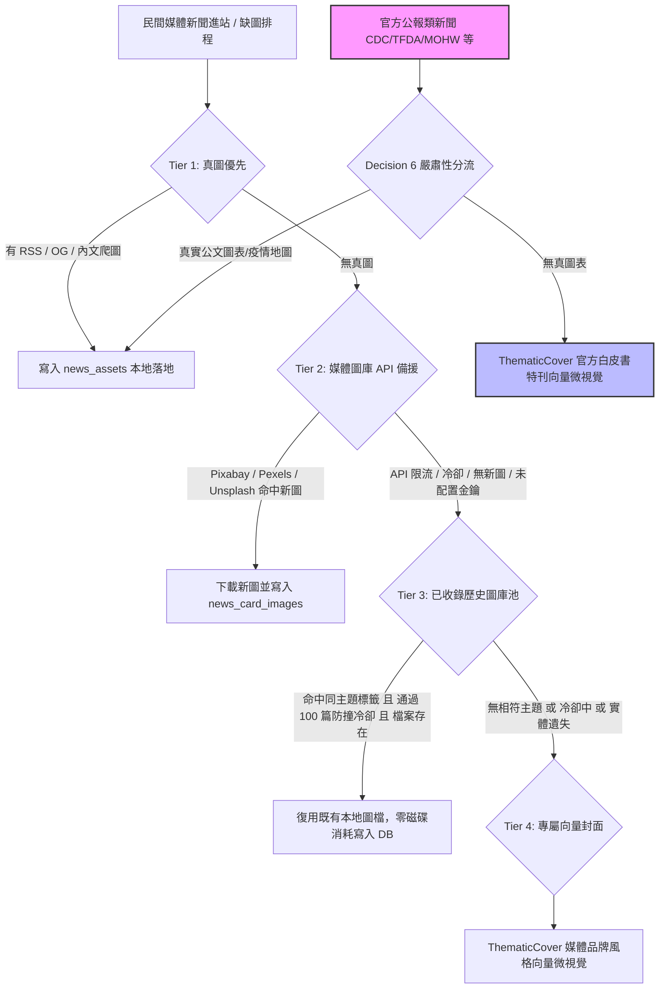

# 四層新聞圖片漏斗架構與歷史圖庫復用規範 (Four-Tier News Card Image Funnel)

- **狀態**：Approved (經正體中文 Grill Me 深度審定共識實施)
- **領域**：新聞視覺呈現（CardThumb / ThematicCover / HeroPost / SearchModal）、資料庫結構放寬與安全遷移（news_card_images）、四層圖片漏斗排程（cardImages.ts）、防撞冷卻窗口（Recency Window Guard）
- **關聯 Ticket**：[Issue #419](https://github.com/j172/health/issues/419)
- **目標**：落實「真圖優先 ➔ 媒體圖庫備援 ➔ 之前已收錄的媒體圖庫 ➔ 專屬向量封面」四層漏斗架構，根絕全站破圖與粗糙字卡，落實官方公報與民間媒體的分流隔離（Decision 6），確保高質感、零 CLS 與零重複硬碟浪費。

---

## 1. 背景與核心問題

全站新聞圖片涵蓋中央部會公報、地方衛生局新聞、主流醫藥媒體、NPO 與各類健康專題。過去存在以下痛點：
1. **媒體圖庫 API 限流即中斷**：Pixabay、Pexels 與 Unsplash 在每小時/每日頻率限制（HTTP 429）或無金鑰環境下，排程直接終止或退回空卡，未能有效利用本地既有庫存。
2. **資料庫唯一性約束阻礙圖檔安全復用**：`news_card_images` 早期建立時包含 `uq_card_image_path (local_path)` 與 `uq_card_image_provider_image (provider, provider_image_id)` 唯一索引，導致同一張醫療或衛教素材圖片無法指派給不同文章，造成 MySQL `ER_DUP_ENTRY` 錯誤。
3. **無防撞窗口引發讀者視覺疲乏**：若歷史圖庫無序復用，首頁或同一分頁相鄰文章可能出現完全相同的模特兒或情境照片。
4. **官方公報與民間媒體界限模糊**：官方機構公報（如疾管署、食藥署、衛福部）若被強行配上歐美商業模特兒圖庫，會嚴重損害公信力；若無圖則退回單調字卡。
5. **次要卡片與搜尋卡缺乏縮圖統一**：`HeroPost` 次要新聞與 `SearchModal` 搜尋結果過去使用純文字色塊或陽春排版，未享有與主列表相同的精緻微視覺體系。

---

## 2. Grill Me 審定核心決策矩陣

| 決策分支 | 審定結論 |
| :--- | :--- |
| **1. Tier 3 庫存匹配邏輯** | **語義關鍵字主題匹配**：以文章標題切詞（中文 token 長度 2-12 字）與 Jieba 核心主題關鍵字（如 `fitness`, `nutrition`, `hospital`, `mental health`），向資料庫檢索過去為相同主題下載過的本地圖庫圖檔，確保復用圖片具備高視覺關聯。 |
| **2. 官方公報邊界** | **堅持嚴肅性分流（遵循 Decision 6）**：官方公報完全不參與 Tier 2 與 Tier 3 的歐美圖庫配圖，維持「真實圖表 ➔ 白皮書向量封面」雙軌；四層漏斗專供民間媒體新聞使用。 |
| **3. 視覺防撞機制** | **近期 100 篇冷卻窗口（Recency Window Guard, RECENCY_COLLISION_WINDOW = 100）**：同一張歷史圖庫若在全站最近 100 篇已發布新聞中出現過，嚴格禁止再次復用；只挑選更早期收錄且近期未曝光的舊圖，確保首頁或同一分頁瀏覽時絕不撞圖。 |
| **4. 資料庫儲存方式** | **放寬 `news_card_images` 單一圖檔唯一約束**：每篇新聞維持獨立一筆記錄（保留 `uq_card_image_news (news_item_id)` 唯一性），解除 `local_path` 與 `provider_image_id` 的全表唯一限制，允許新文章指向既有實體檔案，零硬碟空間重複浪費。 |

---

## 3. 四層漏斗架構（Four-Tier Funnel）



---

## 4. 模組改動與技術規格

### 4.1 資料庫結構放寬與安全遷移 (`lib/server/db/schema.ts` ＆ `mysql.ts`)
- **Schema 調整**：
  - 將 `uq_card_image_hash`、`uq_card_image_path` 放寬為普通索引 `idx_card_image_hash` 與 `idx_card_image_path (local_path(255))`。
  - 保留 `uq_card_image_news (news_item_id)`，維持每篇文章在關聯表中恰好只有一張卡片圖。
- **Migration 安全防護**：
  - 在 `ensureSchema()` 中透過 `dropIndexSafely` 安全解除 `uq_card_image_path`、`uq_card_image_provider_image`、`uq_card_image_hash`、`uq_card_image_pixabay`。

### 4.2 Tier 3 歷史圖庫復用器與防撞冷卻 (`lib/server/news/cardImages.ts`)
- **常數定義**：`export const RECENCY_COLLISION_WINDOW = 100;`
- **防撞名單構建**：
  ```sql
  SELECT c.local_path
  FROM news_card_images c
  JOIN news_items n ON n.id = c.news_item_id
  WHERE c.local_path IS NOT NULL
  ORDER BY COALESCE(n.published_at_utc, n.created_at) DESC
  LIMIT 100
  ```
- **核心比對函式 `tryAssignArchivedStockImage`**：
  1. 萃取文章標題中文 tokens 與 `termsToTry`。
  2. 檢索歷史關聯且非地圖之商業圖庫圖檔。
  3. 檢驗 `recentUsedPaths.has(local_path)`：若命中冷卻窗口則略過。
  4. 檢驗 `fs.existsSync(fullDiskPath)`：若本地檔案遺失則略過。
  5. 執行 `INSERT IGNORE INTO news_card_images`，成功後加入 `recentUsedPaths` 並調用 `revalidateArticlePath(news.id)`。

### 4.3 前端視覺強化與全組件覆蓋
- **`HeroPost.tsx`**：
  - 主焦點卡：增強 `hasError` 狀態捕獲，無圖或破圖時呈現 `ThematicCover`（`heroMode` 滿版模式）。
  - 次要新聞卡：由原本單調無圖字卡重構為精緻的水平圖文卡片，全面採用 `CardThumb` 縮圖。
- **`ThematicCover.tsx`**：
  - 支援 `heroMode` 屬性，在主焦點卡呈現氣勢磅礴的滿版幾何微視覺。
  - 擴充 13 款主流民間媒體品牌配色徽章與 ESG 永續主題。
- **`SearchModal.tsx`**：
  - 全面以 `<CardThumb item={item} sizes="80px" />` 取代既有粗糙之固定灰階文字色塊（`Health` 字卡）。

---

## 5. 驗證與自動化測試

1. **單元測試 (`tests/thematicCoverAndCardThumb.test.mjs`)**：
   - 官方機構隔離性驗證：`isGovSource` 正確分流官方與民間來源。
   - 智能覆蓋驗證：官方公報庫存假圖覆蓋為白皮書特刊，真圖保留。
   - Jieba 核心主題擴充驗證：涵蓋 ESG、數位醫療、長照等領域。
   - 次要卡與搜尋 Modal 整合驗證：全組件消除陽春文字色塊。
   - Tier 3 歷史圖庫復用與 100 篇防撞冷卻窗口驗證。
2. **靜態型別安全**：`npm run typecheck` 0 錯誤。
3. **全站回歸驗證**：`npm test` 404 項測試全數通過（0 failure）。
